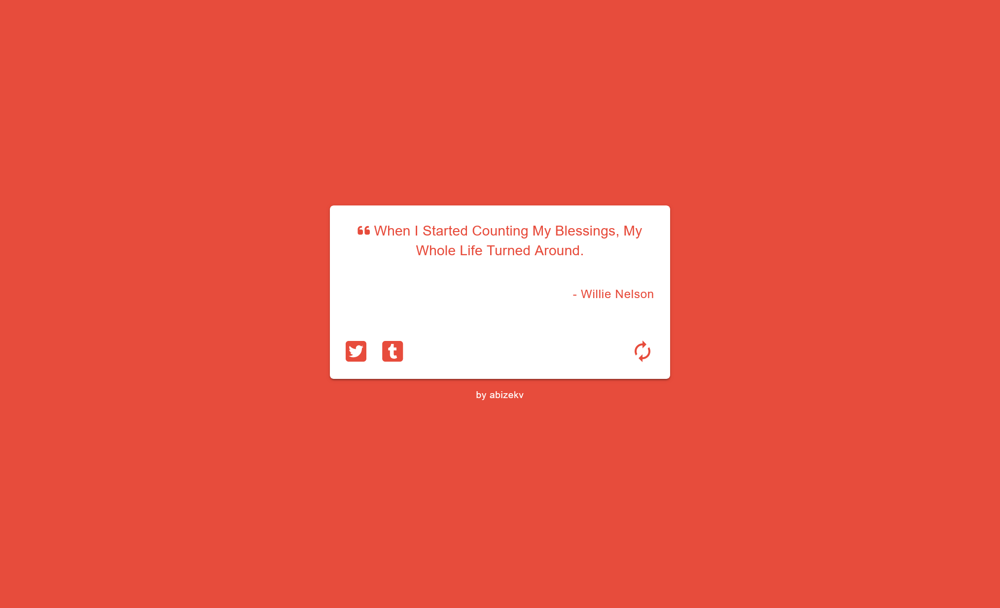

# 💬 Random Quote Generator

📝 **Project Description**

The Random Quote Generator is a web application that fetches and displays a random quote each time you load the page or click the refresh button. It features dynamic color themes, social sharing options (Twitter, Tumblr), and a clean, responsive UI built with React and Material UI.

## 🛠️ Built Using

## 📚 What I've Learned

- How to structure and build a React project using Vite for fast development.
- Fetching data asynchronously from a public API and handling loading states.
- Using Material UI components for rapid and consistent UI development.
- Managing dynamic styles and themes in React.
- Implementing social sharing features (Twitter, Tumblr) with dynamic content.
- Handling state and effects efficiently with React hooks.

## ⚠️ Challenges Faced

- Ensuring the app remains responsive and visually appealing across devices.
- Handling asynchronous data fetching and loading states gracefully.
- Managing color themes and ensuring accessibility with dynamic color changes.
- Integrating social sharing features and encoding content for URLs.
- Providing a smooth user experience with instant feedback and error handling.

## 📬 Contact Me

